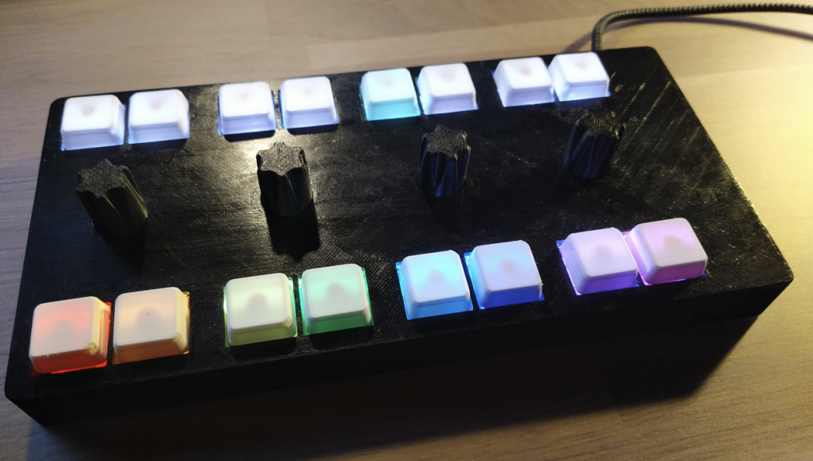
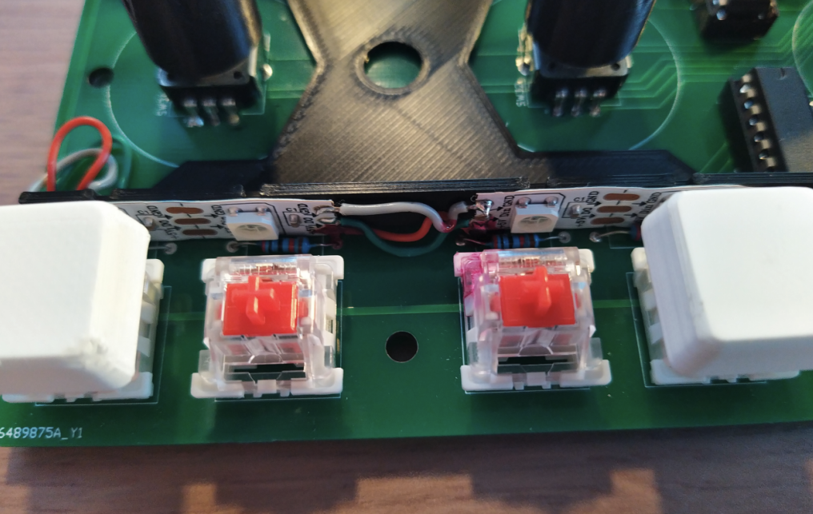
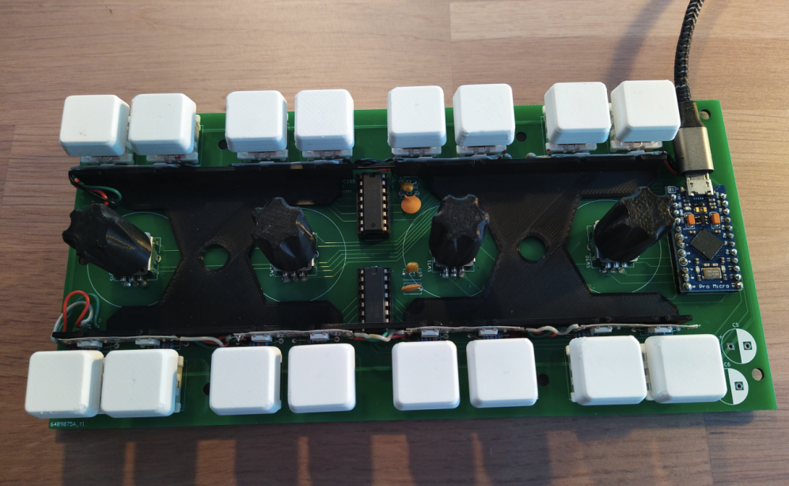

# Midi controller for darktable

- 3D printed housing
  -  stp and stl files available  
- individually illuminated buttons depending on state of the controller using WS2812 RGB LEDs
- arduino compatible pro micro µc
  - extended input channels with 74HC165 shifht registers
  - cherry type mechanical keys
    - 8 top row for mode selction
    - 8 in bottom row for functions
  - 4 alps rotary encoders with button functions
  - powered and connected via usb
- PCB files in KiCad available
- control of darktable via midi protcol
  - fully customizable inside of darktable

## materials
| Part | amount | comment|
| -------- | ------- | ------ |
| PCB | 1 | Kicad files in this repo|
| frontcover | 1 | 3D print|
| backcover | 1 | 3D print|
| LED holder | 1 | 3D print|
| buffer | 7 | 3D print (TPU)|
| encoder knobs | 4 | 3D print|
| keycaps | 16 | 3D print|
| M3x10 screw | 7| |
| micro USB cable| 1 | |
| pro micro atmega32 | 1| arduino compatible cheap MCU|
| 74HC165 | 2|  shift registers|
| cherry type switches | 16 | accordig to taste|
| capacitor 100 nF | 2 | |
| capacitor 1 µF | 2 | or something similar |
| rotary encoder Alps EC12 | 4 | with click|
| pullup resistor | 16 | high resistance recommended > 10k Ohm |
| WS2812 RGB LED | 16 | I used a self adhesive LED strip with 60 LED/m, that way, two can be chained without soldering |
| double tape | some |  to stick the LED holder onto the PCB|
| wire | some | to connect LED strips |

## assembly
- solder al compenents to PCB
- LEDs: this is a little awkward, spacing of LEDs and switches didn't fit and I could't source any reasonably priced THT RGB LEDs
  - two LEDs from the strip are glued to the holder, position is indicated by notches
  - individual strips need to be connected with wire (3 contacts each)
  - LED holder can be glued onto the PCB with some double tape
  - then both strips (top and bottom can be connected to the PCB

- add USB cable
- add TPU buffers to the backcover
- add the case and screws
- knobs and keycaps
- flash arduino SW

## usage
*The controller must be connected during start of darktable, it can only be detected during start!*
after every start, darktable needs to notice that midi CCs are working in relative mode (default is absolute). This can be done by rotating one of the encoders left.

If darktable is running in absolute encoding, input can be reset with ctrl+alt*shift+I then again try to rotate an encoder left.

keymappsings can be imported into darktable: settings -> shortcuts -> import
 => use file *darktable_shortcut_mapping_export*

 With current arduino SW the top row of switches selects the modes, bottom row of buttons and rotary encoders can be assigned to darktable functions

 ## issues
 - darktable does not distinguish for very low "notes" for midi, therefore some buttons cannot be assigned
 - keymapping is not very complete
 
